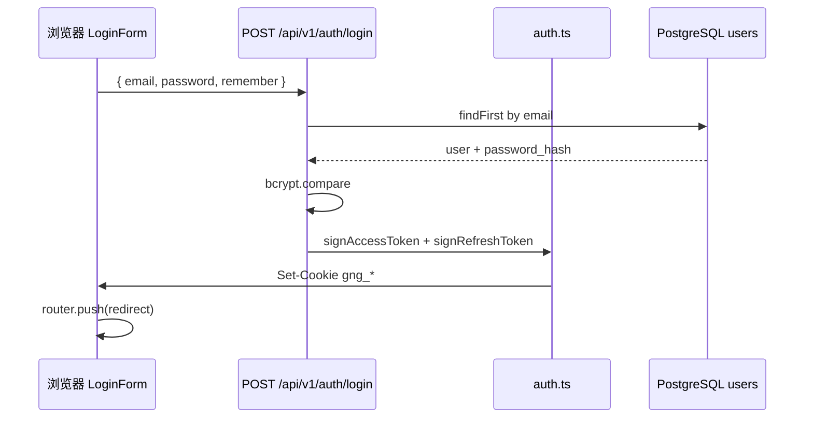
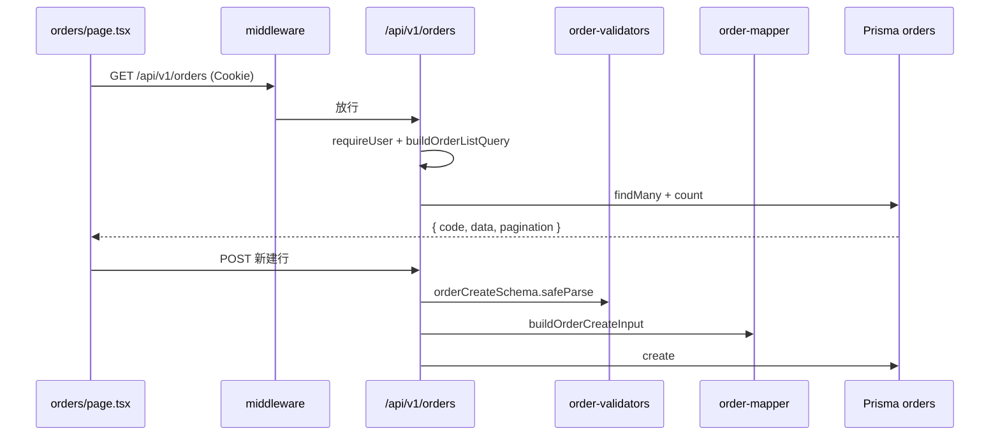
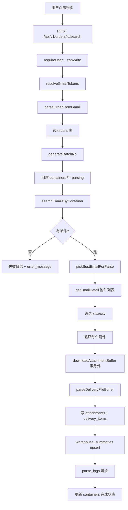

# 请求链路详解（从点击到数据库）

> 三条完整链路，带 **文件跳转顺序** 与 **Vue/Java 对照**。建议打开源码并排阅读。

---

## 链路 A：用户登录

### 流程图



### 阅读顺序

| 步骤 | 文件 | 关注点 |
|------|------|--------|
| 1 | `src/app/login/LoginForm.tsx` | `fetch` POST、`router.push`、`router.refresh` |
| 2 | `src/app/api/v1/auth/login/route.ts` | Zod `loginSchema`、bcrypt、调 `setAuthCookies` |
| 3 | `src/lib/auth.ts` | `signAccessToken`、`setAuthCookies`（`cookies()` from `next/headers`） |
| 4 | `src/middleware.ts` | 下次请求带 Cookie 才放行 |

### 与 Spring 对照

| 步骤 | Spring 典型 |
|------|-------------|
| 登录接口 | `AuthController.login()` |
| 密码校验 | `PasswordEncoder.matches()` |
| 发 Token | `JwtUtil.generate()` + `Response.addCookie()` |
| 后续请求 | `JwtAuthenticationFilter` |

### 后续请求如何识别用户

1. **middleware**：只检查 Cookie 里有没有 access token（不解析 payload）  
2. **API 内** `requireUser(request)`：用 jose 验证 JWT，得到 `{ id, role, email, ... }`  

文件：`src/lib/require-user.ts`

---

## 链路 B：订单列表 CRUD

### 流程图



### 阅读顺序

| 操作 | 前端 | API | Service/Lib |
|------|------|-----|-------------|
| 列表 | `orders/page.tsx` → `loadOrders` | `GET route.ts` | `order-list-query.ts` |
| 新建 | 底部蓝色行保存 | `POST route.ts` | `order-validators` + `order-mapper` |
| 编辑 | 双击行内编辑 | `PUT [id]/route.ts` | 同上 update schema |
| 删除 | 勾选批量删 | `DELETE batch/route.ts` | — |
| **检索** | 操作列按钮 | `POST [id]/search/route.ts` | **`order-parse-service.ts`** → 链路 C |

### 列表 API 典型代码结构

`src/app/api/v1/orders/route.ts`（简化逻辑）：

```
1. requireUser → 401
2. 解析 query：page, pageSize, search, sort
3. buildOrderListWhere / buildOrderListOrderBy
4. prisma.orders.findMany + count
5. return success(serialize(rows), pagination)
```

### 前端典型代码结构

`orders/page.tsx`：

```
1. useState: rows, loading, page, sort, editingRowId, form
2. useEffect → loadOrders()
3. 表格 render：只读 cell vs input cell
4. handleSaveRow → PUT 或 POST
5. handleSearch → POST .../search（见链路 C）
```

---

## 链路 C：订单 Gmail 检索解析（核心业务）

### 流程图



### 阅读顺序（⭐ 最重要）

| 顺序 | 文件 | 看什么 |
|------|------|--------|
| 1 | `src/app/orders/page.tsx` | 检索按钮 → `fetch(.../search)` |
| 2 | `src/app/api/v1/orders/[id]/search/route.ts` | Gmail token、调 service、`maxDuration = 120` |
| 3 | `src/lib/order-parse-service.ts` | **`parseOrderFromGmail` 全文** |
| 4 | `src/lib/batch-no.ts` | `柜号-yyyyMMddHHmmss` |
| 5 | `src/lib/gmail.ts` | 搜邮件、下附件、fallback 策略 |
| 6 | `src/lib/delivery-excel-parser.ts` | Excel/CSV 行解析 |
| 7 | `src/lib/parse-log.ts` | 写 `parse_logs` |
| 8 | `src/app/containers/page.tsx` | 解析结果展示 |
| 9 | `src/components/ParseResultDialog.tsx` | `GET .../containers/[id]/items` |

### 关键设计决策

#### 1. 网络 IO 不在事务里

```typescript
// 先下载、解析（可能失败）
const buffer = await downloadAttachmentBuffer(...);
const parsed = parseDeliveryFileBuffer(buffer, name, containerNo);

// 再开短事务写库
await prisma.$transaction(async (tx) => {
  await tx.attachments.create({ ... });
  await tx.delivery_items.createMany({ ... });
});
```

**原因：** PostgreSQL 事务里若某 SQL 失败，整个事务进入 aborted 状态（`25P02`），后续语句全部失败。Gmail/Excel 失败不应污染 DB 事务。

#### 2. Gmail 搜索 fallback

```
1. from:{GMAIL_DEFAULT_SENDER} {柜号}
2. 若无结果 → 仅搜 {柜号}
```

代码：`gmail.ts` → `searchEmailsByContainer`

#### 3. 批次号 batch_no

同柜号多次「检索」会产生多行 `containers`，用 `batch_no` 区分；`delivery_items`、`warehouse_summaries`、`parse_logs` 都带 `batch_no`。

#### 4. Gmail Token 与登录 Token 分离

| Cookie | 用途 |
|--------|------|
| `gng_access_token` | 系统登录 |
| `gmail_*` | Google OAuth，解析邮件用 |

授权入口：`GET /api/v1/gmail/auth`  
回调：`/api/v1/gmail/callback`

### 解析结果查看

```
GET /api/v1/containers/[id]/items
  → attachments[]
  → 每个 attachment 下 delivery_items[]
```

`ParseResultDialog.tsx` 按附件折叠展示。

---

## 链路 D（补充）：Google Sheet 保存

与订单线 **独立**，共用 Gmail 能力但表不同。

```
google-sheet/page.tsx
  → PUT /api/v1/google-sheet/[id]
  → container-mapper.ts
  → container-history.ts（更新前写快照）
  → prisma.google_sheet.update
```

软删除：`deleted_at` 非 null 表示已删，列表默认过滤。

详情页 `google-sheet/[containerNo]/page.tsx` 可打开 `GmailSearchDialog` 搜邮件（不一定走 order-parse-service）。

---

## 链路 E（补充）：重新解析

```
containers/page.tsx → POST /api/v1/containers/[id]/reparse
  → 再次调用 parse 相关逻辑（基于已有 container 记录）
```

与订单「检索」类似，入口不同。

---

## 调试技巧

| 手段 | 用法 |
|------|------|
| 浏览器 Network | 看 request/response body |
| 服务端 `console.error` | Vercel/终端看 API 日志 |
| `/parse-logs` 页 | 看 `step` / `status` / `message` |
| Prisma Studio | `npx prisma studio` 直接看表数据 |
| Gmail 状态 | `GET /api/v1/gmail/status` |

---

## 三链路对照总结

| | 登录 | 订单 CRUD | Gmail 解析 |
|---|------|-----------|------------|
| 入口组件 | `LoginForm` | `orders/page` | `orders/page` 检索按钮 |
| API | `auth/login` | `orders/route` | `orders/[id]/search` |
| 核心 lib | `auth.ts` | validators+mapper | **`order-parse-service.ts`** |
| 外部依赖 | — | — | Gmail API + ExcelJS |
| 写表 | — | `orders` | `containers` + `attachments` + `delivery_items` + ... |

---

完整 API 表与数据模型见 [项目导读.md](./项目导读.md)。  
Gmail 专题见 **[06-Gmail检索与解析说明.md](./06-Gmail检索与解析说明.md)**。
