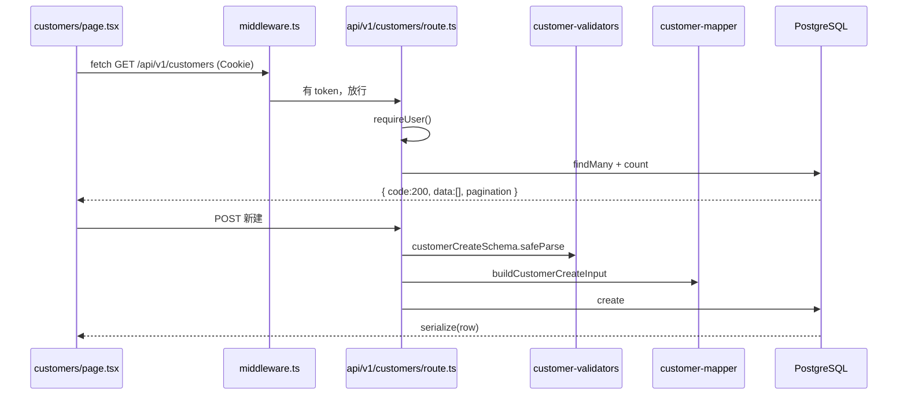

# 手写 CRUD 列表 — 完整教程

> **目标**：从零手写一个「增删改查 + 分页列表」，快速掌握本项目的标准开发套路。  
> **练习模块**：**客户管理**（`/customers`）  
> **对照参考**：订单模块 `orders`（已实现，结构几乎一致）  
> **前置**：Vue / Java 经验；已读过 [02-Next.js与React速成](./02-Next.js与React速成(Vue-Java对照).md)

---

## 0. 你要创建什么

完成后你将拥有：

| 能力 | URL / 文件 |
|------|------------|
| 列表页 | `GET /customers` → `src/app/customers/page.tsx` |
| 列表 API | `GET /api/v1/customers` |
| 新建 | `POST /api/v1/customers` |
| 单条查询 | `GET /api/v1/customers/[id]` |
| 更新 | `PUT /api/v1/customers/[id]` |
| 单条删除（软删） | `DELETE /api/v1/customers/[id]` |
| 批量删除 | `DELETE /api/v1/customers/batch` |

**本教程与订单模块的差异：**

- `customers` 主键是 **BigInt**（订单是 Int）
- `customers` 使用 **软删除** `deleted_at`（订单是物理删除）
- 客户页 **无** Gmail 检索按钮（更纯粹的 CRUD）

---

## 1. 开发套路总览（背下来）

每新增一个 CRUD 模块，固定 **10 步、12 个文件**：

```
① prisma/schema.prisma     （表已存在可跳过）
② prisma/sql/xxx.sql        建表 SQL
③ lib/xxx-columns.ts        列定义
④ lib/xxx-validators.ts     Zod 校验
⑤ lib/xxx-mapper.ts         DTO → Prisma input
⑥ lib/xxx-list-query.ts     搜索 where + 排序 orderBy
⑦ hooks/useXxxTablePreferences.ts  列宽/顺序（可选，建议复制改）
⑧ app/api/v1/xxx/route.ts           GET 列表 + POST 新建
⑨ app/api/v1/xxx/[id]/route.ts      GET/PUT/DELETE 单条
⑩ app/api/v1/xxx/batch/route.ts     DELETE 批量
⑪ app/xxx/page.tsx                  前端页面
⑫ components/layout/Sidebar.tsx     加菜单
```

**对照 Java：**

| 本项目 | Spring |
|--------|--------|
| `route.ts` | `@RestController` |
| `*-validators.ts` | `@Valid` + DTO |
| `*-mapper.ts` | Assembler / MapStruct |
| `*-list-query.ts` | Specification / QueryDSL |
| `*-service.ts` | `@Service`（复杂业务才拆） |
| `page.tsx` | Vue 列表页 |

**路由注册说明（Next.js 无 router.js）：**

- 页面：`src/app/customers/page.tsx` **自动** 注册 `/customers`
- API：`src/app/api/v1/customers/route.ts` **自动** 注册 `/api/v1/customers`
- **不需要** 改 `middleware.ts`（非公开路径会自动要求登录 Cookie）
- **需要** 从 `middleware.ts` **删掉** 旧的重定向（见步骤 10）

---

## 2. 步骤一：确认数据库

### 2.1 Prisma 模型（已存在）

打开 `prisma/schema.prisma`，已有：

```prisma
model customers {
  id          BigInt    @id @default(autoincrement())
  name        String    @db.VarChar(100)
  contact     String?   @db.VarChar(50)
  phone       String?   @db.VarChar(20)
  email       String?   @db.VarChar(100)
  address     String?   @db.VarChar(200)
  is_active   Boolean   @default(true)
  remarks     String?
  created_by  BigInt
  updated_by  BigInt?
  created_at  DateTime  @default(now()) @db.Timestamptz(6)
  updated_at  DateTime  @default(now()) @updatedAt @db.Timestamptz(6)
  deleted_at  DateTime? @db.Timestamptz(6)
  // ...
}
```

### 2.2 创建 SQL 文件

新建 `prisma/sql/customers.sql`：

```sql
CREATE TABLE IF NOT EXISTS customers (
  id          BIGSERIAL PRIMARY KEY,
  name        VARCHAR(100) NOT NULL,
  contact     VARCHAR(50),
  phone       VARCHAR(20),
  email       VARCHAR(100),
  address     VARCHAR(200),
  is_active   BOOLEAN NOT NULL DEFAULT TRUE,
  remarks     TEXT,
  created_by  BIGINT NOT NULL,
  updated_by  BIGINT,
  created_at  TIMESTAMPTZ(6) NOT NULL DEFAULT NOW(),
  updated_at  TIMESTAMPTZ(6) NOT NULL DEFAULT NOW(),
  deleted_at  TIMESTAMPTZ(6)
);

CREATE INDEX IF NOT EXISTS idx_customers_name ON customers (name);
CREATE INDEX IF NOT EXISTS idx_customers_created_at ON customers (created_at DESC);
```

### 2.3 加 npm 脚本

在 `package.json` 的 `scripts` 里加：

```json
"db:customers": "prisma db execute --file prisma/sql/customers.sql --schema prisma/schema.prisma"
```

### 2.4 执行

```bash
npm run db:customers
npx prisma generate
```

---

## 3. 步骤二：列定义 `customer-columns.ts`

新建 `src/lib/customer-columns.ts`：

```typescript
export type CustomerColumnKey =
  | "name"
  | "contact"
  | "phone"
  | "email"
  | "address"
  | "is_active";

export type CustomerDataColumn = {
  key: CustomerColumnKey;
  label: string;
  defaultWidth: number;
  sortable: boolean;
};

export const CUSTOMER_COLUMNS: CustomerDataColumn[] = [
  { key: "name", label: "客户名称", defaultWidth: 160, sortable: true },
  { key: "contact", label: "联系人", defaultWidth: 100, sortable: true },
  { key: "phone", label: "电话", defaultWidth: 120, sortable: false },
  { key: "email", label: "邮箱", defaultWidth: 180, sortable: false },
  { key: "address", label: "地址", defaultWidth: 200, sortable: false },
  { key: "is_active", label: "启用", defaultWidth: 80, sortable: true },
];

export const CUSTOMER_COLUMN_ORDER_STORAGE_KEY = "gng-customers-column-order";
export const CUSTOMER_COLUMN_WIDTH_STORAGE_KEY = "gng-customers-column-widths";

export const CUSTOMER_SORTABLE_KEYS = CUSTOMER_COLUMNS.filter((c) => c.sortable).map(
  (c) => c.key,
);

export function getDefaultCustomerColumnOrder(): CustomerColumnKey[] {
  return CUSTOMER_COLUMNS.map((c) => c.key);
}

export function getDefaultCustomerColumnWidths(): Record<string, number> {
  return Object.fromEntries(CUSTOMER_COLUMNS.map((c) => [c.key, c.defaultWidth]));
}
```

---

## 4. 步骤三：Zod 校验 `customer-validators.ts`

新建 `src/lib/customer-validators.ts`：

```typescript
import { z } from "zod";

export const customerCreateSchema = z.object({
  name: z.string().min(1, "请填写客户名称").max(100),
  contact: z.string().max(50).optional().nullable(),
  phone: z.string().max(20).optional().nullable(),
  email: z.string().email("邮箱格式不正确").max(100).optional().nullable().or(z.literal("")),
  address: z.string().max(200).optional().nullable(),
  is_active: z.boolean().optional().default(true),
  remarks: z.string().optional().nullable(),
});

export const customerUpdateSchema = customerCreateSchema.partial();

export const customerBatchDeleteSchema = z.object({
  ids: z.array(z.string()).min(1, "请选择至少一条记录"),
});
```

---

## 5. 步骤四：Mapper `customer-mapper.ts`

新建 `src/lib/customer-mapper.ts`：

```typescript
import { Prisma } from "@prisma/client";
import type { z } from "zod";
import type { customerCreateSchema } from "@/lib/customer-validators";

type CustomerInput = z.infer<typeof customerCreateSchema>;

function assignFields(
  input: Partial<CustomerInput>,
): Partial<Omit<Prisma.customersCreateInput, "id">> {
  return {
    name: input.name !== undefined ? input.name.trim() : undefined,
    contact: input.contact !== undefined ? input.contact?.trim() || null : undefined,
    phone: input.phone !== undefined ? input.phone?.trim() || null : undefined,
    email: input.email !== undefined ? input.email?.trim() || null : undefined,
    address: input.address !== undefined ? input.address?.trim() || null : undefined,
    is_active: input.is_active !== undefined ? input.is_active : undefined,
    remarks: input.remarks !== undefined ? input.remarks ?? null : undefined,
  };
}

export function buildCustomerCreateInput(
  input: CustomerInput,
  userId: bigint,
): Prisma.customersCreateInput {
  return {
    ...(assignFields(input) as Prisma.customersCreateInput),
    name: input.name.trim(),
    is_active: input.is_active ?? true,
    creator: { connect: { id: userId } },
  };
}

export function buildCustomerUpdateInput(
  input: Partial<CustomerInput>,  // ⚠️ 必须是 Partial，对应 customerUpdateSchema.partial()
  userId: bigint,
): Prisma.customersUpdateInput {
  const data: Prisma.customersUpdateInput = assignFields(input);
  data.updater = { connect: { id: userId } };
  return data;
}
```

---

## 6. 步骤五：列表查询 `customer-list-query.ts`

新建 `src/lib/customer-list-query.ts`：

```typescript
import { Prisma } from "@prisma/client";
import { CUSTOMER_SORTABLE_KEYS, type CustomerColumnKey } from "@/lib/customer-columns";

const SORTABLE_SET = new Set<string>(CUSTOMER_SORTABLE_KEYS);

export type SortOrder = "asc" | "desc";

/** 列表默认只查未软删的记录 */
export const customerListBaseWhere: Prisma.customersWhereInput = {
  deleted_at: null,
};

export function parseCustomerSortParams(sortBy: string | null, sortOrder: string | null) {
  const order: SortOrder = sortOrder === "desc" ? "desc" : "asc";
  if (!sortBy || sortBy === "default" || !SORTABLE_SET.has(sortBy)) {
    return { sortBy: null as CustomerColumnKey | null, sortOrder: order };
  }
  return { sortBy: sortBy as CustomerColumnKey, sortOrder: order };
}

export function buildCustomerListOrderBy(
  sortBy: CustomerColumnKey | null,
  sortOrder: SortOrder,
): Prisma.customersOrderByWithRelationInput[] {
  if (!sortBy) return [{ id: "desc" }];
  return [{ [sortBy]: sortOrder }, { id: "desc" }];
}

export function buildCustomerSearchWhere(
  keyword?: string | null,
): Prisma.customersWhereInput {
  const base = { ...customerListBaseWhere };
  if (!keyword?.trim()) return base;
  const q = keyword.trim();
  return {
    ...base,
    OR: [
      { name: { contains: q, mode: "insensitive" } },
      { contact: { contains: q, mode: "insensitive" } },
      { phone: { contains: q, mode: "insensitive" } },
    ],
  };
}
```

---

## 7. 步骤六：列偏好 Hook

复制 `src/hooks/useOrderTablePreferences.ts` → `src/hooks/useCustomerTablePreferences.ts`，**不要**对全文做 `order → customer` 全局替换（会把 `columnOrder`、`ORDER_STORAGE_KEY` 里的 order 误改）。

**只改这些：**

| 原（订单） | 改为（客户） |
|------------|--------------|
| `order-columns` | `customer-columns` |
| `OrderColumnKey` | `CustomerColumnKey` |
| `ORDER_` 前缀 | `CUSTOMER_` 前缀 |
| `useOrderTablePreferences` | `useCustomerTablePreferences` |

**必须保持不变的命名（表示「列顺序」，不是业务订单）：**

- `columnOrder` / `setColumnOrder`（不要改成 `columnCustomer`）
- `CUSTOMER_COLUMN_ORDER_STORAGE_KEY`（不要改成 `..._CUSTOMER_STORAGE_KEY`）
- `getDefaultCustomerColumnOrder`（不要改成 `...ColumnCustomer`）
- `persistOrder` / `savedOrder`

对照已修好的 `src/hooks/useCustomerTablePreferences.ts` 或 `useOrderTablePreferences.ts` 逐行改 import 与类型即可。

---

## 8. 步骤七：API — 列表 + 新建

新建 `src/app/api/v1/customers/route.ts`：

```typescript
import { prisma } from "@/lib/prisma";
import { canWrite } from "@/lib/auth";
import { error, success } from "@/lib/api-response";
import { buildCustomerCreateInput } from "@/lib/customer-mapper";
import {
  buildCustomerListOrderBy,
  buildCustomerSearchWhere,
  parseCustomerSortParams,
} from "@/lib/customer-list-query";
import { requireUser } from "@/lib/require-user";
import { serialize } from "@/lib/serialize";
import { customerCreateSchema } from "@/lib/customer-validators";

export async function GET(request: Request) {
  const user = await requireUser(request as import("next/server").NextRequest);
  if (!user) return error("Unauthorized", 401);

  const { searchParams } = new URL(request.url);
  const page = Math.max(1, Number(searchParams.get("page") ?? 1));
  const pageSize = Math.min(200, Math.max(1, Number(searchParams.get("pageSize") ?? 50)));
  const keyword = searchParams.get("keyword")?.trim();
  const { sortBy, sortOrder } = parseCustomerSortParams(
    searchParams.get("sortBy"),
    searchParams.get("sortOrder"),
  );
  const skip = (page - 1) * pageSize;
  const where = buildCustomerSearchWhere(keyword);
  const orderBy = buildCustomerListOrderBy(sortBy, sortOrder);

  const [total, items] = await Promise.all([
    prisma.customers.count({ where }),
    prisma.customers.findMany({
      where,
      orderBy,
      skip,
      take: pageSize,
      include: {
        creator: { select: { full_name: true } },
        updater: { select: { full_name: true } },
      },
    }),
  ]);

  return success(serialize(items), {
    page,
    pageSize,
    total,
    totalPages: Math.ceil(total / pageSize),
  });
}

export async function POST(request: Request) {
  const user = await requireUser(request as import("next/server").NextRequest);
  if (!user) return error("Unauthorized", 401);
  if (!canWrite(user.role)) return error("权限不足", 403);

  try {
    const body = await request.json();
    const parsed = customerCreateSchema.safeParse(body);
    if (!parsed.success) {
      return error(
        "Validation failed",
        400,
        parsed.error.issues.map((issue) => ({
          field: issue.path.join("."),
          message: issue.message,
        })),
      );
    }

    const created = await prisma.customers.create({
      data: buildCustomerCreateInput(parsed.data, BigInt(user.id)),
    });
    return success(serialize(created));
  } catch (err) {
    console.error("[customers POST]", err);
    return error("创建失败", 500);
  }
}
```

---

## 9. 步骤八：API — 单条 GET / PUT / DELETE

新建 `src/app/api/v1/customers/[id]/route.ts`：

```typescript
import { prisma } from "@/lib/prisma";
import { canDelete, canWrite } from "@/lib/auth";
import { error, success } from "@/lib/api-response";
import { buildCustomerUpdateInput } from "@/lib/customer-mapper";
import { customerListBaseWhere } from "@/lib/customer-list-query";
import { requireUser } from "@/lib/require-user";
import { serialize } from "@/lib/serialize";
import { customerUpdateSchema } from "@/lib/customer-validators";

type Params = { params: { id: string } };

export async function GET(request: Request, { params }: Params) {
  const user = await requireUser(request as import("next/server").NextRequest);
  if (!user) return error("Unauthorized", 401);

  let id: bigint;
  try {
    id = BigInt(params.id);
  } catch {
    return error("无效 ID", 400);
  }

  const item = await prisma.customers.findFirst({
    where: { id, ...customerListBaseWhere },
  });
  if (!item) return error("记录不存在", 404);
  return success(serialize(item));
}

export async function PUT(request: Request, { params }: Params) {
  const user = await requireUser(request as import("next/server").NextRequest);
  if (!user) return error("Unauthorized", 401);
  if (!canWrite(user.role)) return error("权限不足", 403);

  let id: bigint;
  try {
    id = BigInt(params.id);
  } catch {
    return error("无效 ID", 400);
  }

  try {
    const body = await request.json();
    const parsed = customerUpdateSchema.safeParse(body);
    if (!parsed.success) {
      return error(
        "Validation failed",
        400,
        parsed.error.issues.map((issue) => ({
          field: issue.path.join("."),
          message: issue.message,
        })),
      );
    }

    const existing = await prisma.customers.findFirst({
      where: { id, ...customerListBaseWhere },
    });
    if (!existing) return error("记录不存在", 404);

    const updated = await prisma.customers.update({
      where: { id },
      data: buildCustomerUpdateInput(parsed.data, BigInt(user.id)),
    });
    return success(serialize(updated));
  } catch (err) {
    console.error("[customers PUT]", err);
    return error("更新失败", 500);
  }
}

export async function DELETE(request: Request, { params }: Params) {
  const user = await requireUser(request as import("next/server").NextRequest);
  if (!user) return error("Unauthorized", 401);
  if (!canDelete(user.role)) return error("权限不足", 403);

  let id: bigint;
  try {
    id = BigInt(params.id);
  } catch {
    return error("无效 ID", 400);
  }

  const existing = await prisma.customers.findFirst({
    where: { id, ...customerListBaseWhere },
  });
  if (!existing) return error("记录不存在", 404);

  await prisma.customers.update({
    where: { id },
    data: { deleted_at: new Date() },
  });
  return success({ id: params.id });
}
```

---

## 10. 步骤九：API — 批量软删

新建 `src/app/api/v1/customers/batch/route.ts`：

```typescript
import { prisma } from "@/lib/prisma";
import { canDelete } from "@/lib/auth";
import { error, success } from "@/lib/api-response";
import { customerListBaseWhere } from "@/lib/customer-list-query";
import { requireUser } from "@/lib/require-user";
import { customerBatchDeleteSchema } from "@/lib/customer-validators";

export async function DELETE(request: Request) {
  const user = await requireUser(request as import("next/server").NextRequest);
  if (!user) return error("Unauthorized", 401);
  if (!canDelete(user.role)) return error("权限不足", 403);

  try {
    const body = await request.json();
    const parsed = customerBatchDeleteSchema.safeParse(body);
    if (!parsed.success) return error("Validation failed", 400);

    const ids = parsed.data.ids
      .map((id) => {
        try {
          return BigInt(id);
        } catch {
          return null;
        }
      })
      .filter((id): id is bigint => id !== null);

    const result = await prisma.customers.updateMany({
      where: { id: { in: ids }, ...customerListBaseWhere },
      data: { deleted_at: new Date() },
    });

    return success({ deleted: result.count });
  } catch (err) {
    console.error("[customers batch DELETE]", err);
    return error("批量删除失败", 500);
  }
}
```

---

## 11. 步骤十：前端页面

### 11.1 最快方式（推荐练手）

1. 复制 `src/app/orders/page.tsx` → `src/app/customers/page.tsx`
2. 按下面替换表逐项改（用 IDE 全局替换要小心语义）：

| 订单 | 客户 |
|------|------|
| `Order` | `Customer` |
| `order` | `customer` |
| `orders` | `customers` |
| `containerNo` | `keyword` |
| `container_no` 等订单字段 | `name`, `contact`, `phone`... |
| `/api/v1/orders` | `/api/v1/customers` |
| `useOrderTablePreferences` | `useCustomerTablePreferences` |
| `ORDER_COLUMNS` 相关 | `CUSTOMER_COLUMNS` 相关 |
| 删除 `handleSearch`、检索按钮、`Mail` 图标 | — |
| 标题「订单管理」 | 「客户管理」 |
| 搜索框 placeholder「柜号」 | 「客户名称/联系人/电话」 |

3. 修改 `RowForm` / `OrderRow` 类型：

```typescript
type CustomerRow = {
  id: string;
  name: string;
  contact?: string | null;
  phone?: string | null;
  email?: string | null;
  address?: string | null;
  is_active?: boolean;
  remarks?: string | null;
};

type RowForm = {
  name: string;
  contact: string;
  phone: string;
  email: string;
  address: string;
  is_active: boolean;
};
```

4. `renderEditableInput` 里为 `is_active` 加 checkbox：

```tsx
if (key === "is_active") {
  return (
    <input
      type="checkbox"
      checked={form.is_active}
      onChange={(e) => onChange("is_active", e.target.checked)}
      className="rounded border-slate-300"
    />
  );
}
```

5. `renderReadOnlyCell` 里：

```tsx
if (key === "is_active") {
  return row.is_active ? "是" : "否";
}
```

6. `buildPayload`：

```typescript
function buildPayload(form: RowForm) {
  return {
    name: form.name.trim(),
    contact: form.contact.trim() || null,
    phone: form.phone.trim() || null,
    email: form.email.trim() || null,
    address: form.address.trim() || null,
    is_active: form.is_active,
  };
}
```

7. `loadRows` 里搜索参数：

```typescript
if (keyword.trim()) params.set("keyword", keyword.trim());
```

8. 文件顶部保留 `"use client";`

### 11.2 页面数据流（理解即可）

```
useEffect → loadUser()     → GET /api/v1/auth/me
useEffect → loadRows()     → GET /api/v1/customers?page=1&...
双击行   → handleStartEdit → 行内表单
保存     → PUT /api/v1/customers/{id}
新建行   → POST /api/v1/customers
删除     → DELETE /api/v1/customers/{id}
批量删除 → DELETE /api/v1/customers/batch  body: { ids: [...] }
```

---

## 12. 步骤十一：侧边栏 + 修复 middleware

### 12.1 Sidebar

编辑 `src/components/layout/Sidebar.tsx`：

```typescript
import { Users, /* 其他 icon */ } from "lucide-react";

const navItems = [
  // ...existing
  { href: "/customers", label: "客户管理", icon: Users },
];
```

### 12.2 删除 middleware 里的旧重定向

打开 `src/middleware.ts`，**删除** 这段（否则 `/customers` 会被跳到 google-sheet）：

```typescript
if (
  pathname === "/customers" ||
  pathname.startsWith("/customers/")
) {
  return NextResponse.redirect(new URL("/google-sheet", request.url));
}
```

---

## 13. 步骤十二：自测清单

```bash
npm run dev
```

| # | 操作 | 期望 |
|---|------|------|
| 1 | 访问 `/customers` 未登录 | 跳转 `/login?redirect=/customers` |
| 2 | 登录后打开客户管理 | 表格加载，Network 见 `GET /api/v1/customers` |
| 3 | 点「新建」，填名称，保存 | `POST` 201/200，列表出现新行 |
| 4 | 双击某行，改电话，保存 | `PUT` 成功，toast「保存成功」 |
| 5 | 点「删除」 | `DELETE` 成功，行消失（软删） |
| 6 | 勾选多行批量删除 | `DELETE batch`，`data.deleted` > 0 |
| 7 | 搜索框输入关键字 | 列表过滤 |
| 8 | 点列头排序 | URL 参数 `sortBy` / `sortOrder` 变化 |
| 9 | viewer 角色登录 | 无新建/编辑/删除按钮（只读） |

构建验证：

```bash
npm run build
```

---

## 14. 请求链路一图流



---

## 15. 常见错误

| 现象 | 原因 | 处理 |
|------|------|------|
| `/customers` 跳到 google-sheet | middleware 旧重定向 | 删步骤 12.2 那段 |
| `P2022 column does not exist` | 库表未建 | `npm run db:customers` |
| BigInt 序列化报错 | 忘了 serialize | API 返回前 `serialize(data)` |
| `401 Unauthorized` | Cookie 过期 | 重新登录 |
| `403 权限不足` | viewer 角色 | 用 admin 测写操作 |
| 删除后仍能在 DB 看到 | 软删除 | 正常，`deleted_at` 非空 |
| email 校验失败 | 空字符串 | mapper 里 `|| null`，或 Zod 允许 `""` |

---

## 16. 练完后的迁移模板

以后新增任意模块（如「司机管理」），把本文 **customers** 全局替换成新名字，改字段即可：

1. schema + sql  
2. `*-columns / validators / mapper / list-query`  
3. 三个 route 文件  
4. 复制 page + hook  
5. Sidebar 一项  

复杂业务（Gmail、Excel、事务）再抽到 `*-service.ts`，CRUD 列表 **不必** 单独建 Service。

---

## 17. 对照源码

| 客户（你要写） | 订单（已实现，随时对照） |
|----------------|--------------------------|
| `src/lib/customer-*.ts` | `src/lib/order-*.ts` |
| `src/app/api/v1/customers/` | `src/app/api/v1/orders/` |
| `src/app/customers/page.tsx` | `src/app/orders/page.tsx` |

---

**下一步**：按步骤 1→12 手写一遍；卡住时打开 `orders` 对应文件 diff 对照。  
完成后你就掌握了本项目 **90% 的日常开发模式**。
