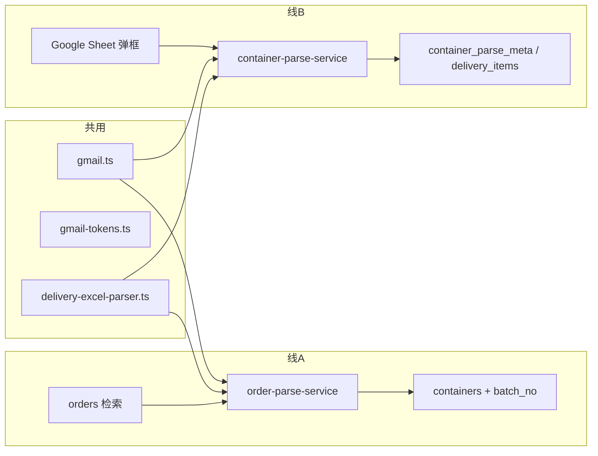
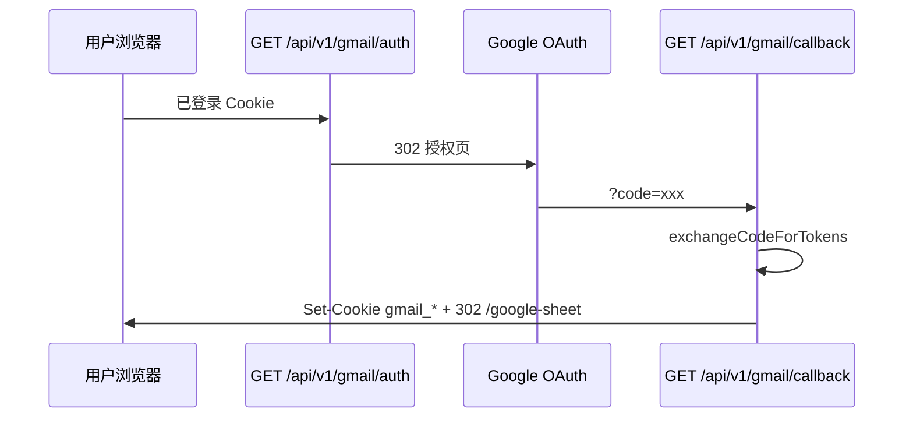
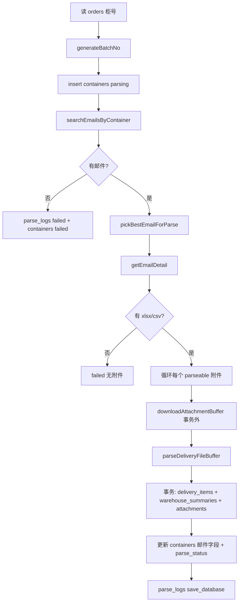

# Gmail 检索与解析 — 完整说明

> 梳理本项目 **Google Gmail 搜邮件 → 下载附件 → 解析 Excel/CSV → 入库** 的全链路。  
> 与「Google Sheet 表格模块」配合使用，但代码上分 **两条业务线**。

---

## 一、这套能力解决什么问题

业务场景：货代/物流收到带 **柜号** 的邮件，附件里是 **派送明细表**（xlsx 或 csv）。系统需要：

1. 按柜号在 Gmail 里 **搜到对应邮件**
2. **下载** Excel/CSV 附件
3. **解析** 行数据（FBA、仓库、箱数等）
4. **写入数据库**，并在页面展示解析结果、日志、仓库汇总

---

## 二、两条业务线（必分清）

| 对比项 | **线 A：订单管理检索** | **线 B：Google Sheet / 按柜号** |
|--------|------------------------|----------------------------------|
| **入口** | 订单页点「检索」 | Google Sheet 详情页「邮件」弹框；或 `POST .../by-no/{柜号}` |
| **前置数据** | `orders` 表有订单 | `google_sheet` 先有柜号记录 |
| **核心 Service** | `order-parse-service.ts` | `container-parse-service.ts` |
| **解析记录** | `containers` + **`batch_no`**（每次检索一条） | 更新 `container_parse_meta` + 写 `delivery_items`（按柜号覆盖） |
| **附件表** | 有独立 `attachments` 表 | 旧链路偏 `container_parse_meta` |
| **CSV 支持** | ✅（`isParseable`） | 弹框 parse-attachment 走 `parseDeliveryFileBuffer` ✅ |

**共用部分：** `gmail.ts`（搜邮件、下附件）、`gmail-tokens.ts`（OAuth Cookie）、`delivery-excel-parser.ts`（解析表体）。



---

## 三、认证：两套 Cookie，不要混

| Cookie | 用途 | 谁签发 |
|--------|------|--------|
| `gng_access_token` / `gng_refresh_token` | **登录系统** | `auth.ts`（`/api/v1/auth/login`） |
| `gmail_access_token` / `gmail_refresh_token` | **读 Gmail** | Gmail OAuth 回调 |

- 能登录 ≠ 能搜 Gmail；检索前必须完成 **Gmail OAuth**。
- Gmail Token 由 `gmail-tokens.ts` 读写；API 里统一 `resolveGmailTokens(request)`。

### 3.1 OAuth 流程



| 步骤 | 文件 |
|------|------|
| 发起授权 | `src/app/api/v1/gmail/auth/route.ts` → `getAuthUrl()` |
| 回调换 Token | `src/app/api/v1/gmail/callback/route.ts` → `exchangeCodeForTokens()` |
| 写 Cookie | `setGmailTokenCookies()` in `gmail-tokens.ts` |
| 授权成功提示 | `GmailAuthNotifier.tsx`（读 `?gmail_connected=true`） |

### 3.2 环境变量

```env
GOOGLE_CLIENT_ID=
GOOGLE_CLIENT_SECRET=
GOOGLE_REDIRECT_URI=http://localhost:3000/api/v1/gmail/callback
GMAIL_DEFAULT_SENDER=wenyang@ggtransport.in
```

- **Scope**：`gmail.readonly`（只读邮件与附件，无需 Drive）
- 生产环境 `GOOGLE_REDIRECT_URI` 必须与 Google Cloud Console 里配置一致

### 3.3 Token 刷新

`resolveGmailTokens` 逻辑：

1. Cookie 里有 `gmail_access_token` → 直接用  
2. 只有 `gmail_refresh_token` → 调 `refreshAccessToken()`，响应里 `refreshed: true` 时 API 会 `setGmailTokenCookies` 写回  

过期/失效时 API 返回 `401`，且 `meta.needReconnect: true`，前端应引导用户再访问 `/api/v1/gmail/auth`。

---

## 四、Gmail 搜索：`gmail.ts`

### 4.1 搜索策略（Fallback）

函数：`searchEmailsByContainer(containerNo, sender?, accessToken, refreshToken?)`

```
查询 1：from:{GMAIL_DEFAULT_SENDER} {柜号}
   ↓ 无结果
查询 2：{柜号}   （不限发件人）
```

每条命中邮件拉 metadata（Subject / From / Date），并标记 `hasExcelAttachment`（含 xlsx **或 csv）。

**典型场景：** 默认发件人是 `wenyang@ggtransport.in`，实际邮件来自 `18920078209@139.com` 时，第一次查不到，第二次仅柜号能命中。

### 4.2 选「最佳邮件」

多封命中时：`pickBestEmailForParse()`

- 优先有 `isParseable` 附件的邮件  
- 再比 snippet 长度、附件数量、大小等打分  
- 线 A 全自动用这封；线 B 弹框里用户可自己点某一封看详情  

### 4.3 邮件详情与附件

`getEmailDetail(messageId, ...)`：

- 正文 text/html  
- 附件列表 `AttachmentInfo`（`isExcel` / `isCsv` / `isParseable`）  
- 可选：用 ExcelJS 预览第一个可解析附件（调试/弹框展示用）

`downloadAttachmentBuffer(messageId, attachmentId, ...)`：返回 `Buffer`，供解析层使用。

### 4.4 可解析附件判定

```typescript
// 满足任一即可
isExcelMimeType(mimeType)   // xlsx / xls
isCsvFile(mimeType, filename) // .csv 或 csv mime
```

---

## 五、线 A：订单「检索」全链路（主流程）

### 5.1 入口

```
订单页 orders/page.tsx
  → 操作列「检索」
  → POST /api/v1/orders/[id]/search
  → parseOrderFromGmail()   // order-parse-service.ts
```

API 设置 `maxDuration = 120`（Vercel 长任务）。

### 5.2 流程图



### 5.3 批次号 `batch_no`

```typescript
// batch-no.ts — 批次号统一使用 containers.id
containerBatchNo(containerId: number) => String(containerId)
```

同柜多次「检索」产生多行 `containers`，靠 `batch_no` 区分；`delivery_items`、`warehouse_summaries`、`parse_logs` 都带同一 `batch_no`。

### 5.4 为何下载/解析不在事务里

`parseAndPersistAttachment` 注释：**避免 PostgreSQL 25P02**（事务中一条 SQL 失败后整事务 aborted，后续语句全挂）。  
模式：**先 IO/解析 → 再开短事务写库**。

### 5.5 解析状态

| parse_status | 含义 |
|--------------|------|
| `parsing` | 进行中 |
| `success` | 全部附件 OK |
| `partial_success` | 部分成功或有 warning |
| `failed` | 无邮件 / 无附件 / 全失败 |

### 5.6 写入哪些表

| 表 | 内容 |
|----|------|
| `containers` | 一次检索一条，邮件主题/发件人/附件名等 |
| `attachments` | 每个解析的附件一行 |
| `delivery_items` | 明细行（FBA、仓库、箱数…） |
| `warehouse_summaries` | 按 `container_no + warehouse_code + batch_no` 汇总 |
| `parse_logs` | 步骤日志 |

### 5.7 重新解析

`POST /api/v1/containers/[id]/reparse` → `reparseContainerFromGmail()`（基于原 `order_id` 再走一遍，**新 batch**）。

---

## 六、线 B：Google Sheet / 弹框检索

### 6.1 前端：`GmailSearchDialog`

位置：`google-sheet/[containerNo]/page.tsx`

| 用户操作 | 请求 |
|----------|------|
| 打开弹框 | 自动 `GET /api/v1/gmail/search?containerNo=xxx` |
| 看某封邮件 | `GET /api/v1/gmail/message/{id}` |
| 解析某附件入库 | `POST /api/v1/containers/by-no/{柜号}/parse-attachment` |
| 未授权 | 跳转 `/api/v1/gmail/auth` |

### 6.2 按柜号一键解析（旧 API）

`POST /api/v1/containers/by-no/[containerNo]` → `parseContainerEmail()`

- 要求 `google_sheet` 已有该柜号  
- 自动搜邮件 → 选最佳 → 下 Excel → 解析 → 覆盖该柜号下旧 `delivery_items`  
- 更新 `container_parse_meta` 邮件元数据  

### 6.3 与线 A 的差异摘要

- 线 B **不一定**写 `containers.batch_no` 批次模型（以 `container-parse-service` 为准）  
- 弹框可 **手动选附件**；线 A **自动处理所有** parseable 附件  

---

## 七、Excel/CSV 解析：`delivery-excel-parser.ts`

> **专题文档：** [07-Excel解析说明.md](./07-Excel解析说明.md)（表头识别、列映射、CSV、汇总、调试）

入口：`parseDeliveryFileBuffer(buffer, filename, containerNo)`

1. `.csv` → 手工拆行  
2. 否则 → ExcelJS 读 xlsx  
3. `detectHeaderRow`：找含 FBA、仓库、箱数等关键词的行  
4. `FIELD_ALIASES`：中英文列名 → 标准字段  
5. 输出 `DeliveryParseResult`：`items[]` + `summaries[]` + `warnings[]`  

主要字段：`customer_code`, `fba_id`, `reference_id`, `cbm`, `weight`, `carton_count`, `warehouse_code`, `delivery_method` 等。

**改列映射：** 编辑 `FIELD_ALIASES` 与 `HEADER_KEYWORDS`（详见 07 文档）。

---

## 八、解析日志：`parse-log.ts`

`writeParseLog(tx, { step, status, message, batch_no, ... })`

### 线 A 常见 step

| step | 典型 message |
|------|----------------|
| `search_email` | 找到 N 封 / 未找到 |
| `parse_excel` | 某附件解析 N 条 |
| `save_database` | 解析完成汇总 |
| `parse_pipeline` | 未捕获异常 |

页面 **`/parse-logs`** 按柜号、批次筛选查看。

---

## 九、API 一览

### Gmail

| 方法 | 路径 | 说明 |
|------|------|------|
| GET | `/api/v1/gmail/auth` | 跳转 Google 授权（需已登录） |
| GET | `/api/v1/gmail/callback` | OAuth 回调，写 gmail Cookie |
| GET | `/api/v1/gmail/status` | 是否已连接 Gmail |
| GET | `/api/v1/gmail/search?containerNo=&sender=` | 搜邮件列表 |
| GET | `/api/v1/gmail/message/[id]` | 邮件详情 + 附件预览 |

### 订单检索（线 A）

| 方法 | 路径 | 说明 |
|------|------|------|
| POST | `/api/v1/orders/[id]/search` | **一键 Gmail 检索解析** |
| POST | `/api/v1/containers/[id]/reparse` | 重新解析 |

### 按柜号（线 B）

| 方法 | 路径 | 说明 |
|------|------|------|
| POST | `/api/v1/containers/by-no/[containerNo]` | 自动搜邮件并解析 |
| POST | `/api/v1/containers/by-no/[containerNo]/parse-attachment` | 指定附件解析 |
| GET | `/api/v1/containers/by-no/[containerNo]` | 查询解析结果 |

### 查询解析产出

| 方法 | 路径 |
|------|------|
| GET | `/api/v1/containers` |
| GET | `/api/v1/containers/[id]/items` |
| GET | `/api/v1/parse-logs` |
| GET | `/api/v1/warehouse-summaries` |

---

## 十、前端入口汇总

| 页面 | 触发方式 |
|------|----------|
| `/orders` | 行操作「检索」→ `POST .../orders/[id]/search` |
| `/google-sheet/[containerNo]` | `GmailSearchDialog` 按钮「邮件」 |
| `/containers` | 查看解析结果、重新解析 |
| `/parse-logs` | 看步骤日志 |
| `/warehouse-summaries` | 看仓库箱数汇总 |

未连接 Gmail 时，订单检索会 toast 并 `window.open('/api/v1/gmail/auth')`。

---

## 十一、核心源码索引（精读顺序）

| 顺序 | 文件 | 读什么 |
|------|------|--------|
| 1 | `src/lib/gmail-tokens.ts` | Cookie、refresh |
| 2 | `src/lib/gmail.ts` | 搜索 fallback、下附件 |
| 3 | `src/app/api/v1/gmail/search/route.ts` | API 壳 |
| 4 | `src/lib/delivery-excel-parser.ts` | 表头识别、列映射 |
| 5 | **`src/lib/order-parse-service.ts`** | 线 A 主流程 ⭐ |
| 6 | `src/lib/container-parse-service.ts` | 线 B |
| 7 | `src/components/GmailSearchDialog.tsx` | 弹框 UI |
| 8 | `src/app/orders/page.tsx` | `handleSearch` |

---

## 十二、常见问题

| 现象 | 原因 | 处理 |
|------|------|------|
| 401 needReconnect | Gmail Token 过期/未授权 | 访问 `/api/v1/gmail/auth` |
| 未找到邮件 | 发件人不在默认邮箱 | 已 fallback 仅柜号；查柜号是否拼错 |
| 无 Excel/CSV 附件 | 附件类型不对 | 确认 `.xlsx` / `.csv` |
| 解析 0 条 | 表头/列名不匹配 | 改 `FIELD_ALIASES` 或看 `parse_logs` |
| 25P02 事务 aborted | 旧版在事务里做 IO | 当前已 IO 外置，部署最新代码 |
| 本地 3001 端口 | 3000 被占用 | 统一用一个 dev 进程 |
| Redirect URI mismatch | OAuth 配置不一致 | 改 Google Console + `.env` |

---

## 十三、本地调试步骤

```bash
# 1. .env 配好 GOOGLE_* 和 GMAIL_DEFAULT_SENDER
npm run dev

# 2. 登录系统
# 3. 浏览器打开（完成 Gmail 授权）
http://localhost:3000/api/v1/gmail/auth

# 4. 订单页点「检索」，或 Google Sheet 详情点「邮件」
# 5. 看 /parse-logs 与 /containers
```

调试搜邮件可不经过业务，直接：

```
GET /api/v1/gmail/search?containerNo=EGSU6027772
```

（需带登录 Cookie + gmail Cookie）

---

## 十四、扩展开发指引

| 需求 | 改哪里 |
|------|--------|
| 改默认发件人 | `.env` `GMAIL_DEFAULT_SENDER` |
| 改搜索语法 | `gmail.ts` → `searchEmailsByContainer` 的 `queries` |
| 支持新附件类型 | `isParseableFile()` + `delivery-excel-parser` |
| 改入库字段 | `delivery-excel-parser` + `deliveryItemToCreateInput` + Prisma |
| 加解析步骤日志 | `order-parse-service` → `logStep(...)` |
| 新页面一键检索 | 复制 `orders/page.tsx` 的 `handleSearch` + 调 search API |

---

*与 [04-请求链路详解(从点击到数据库).md](./04-请求链路详解(从点击到数据库).md) 第三章互补：该文档偏 Gmail 专题；链路文档偏通用 CRUD + 登录。*
