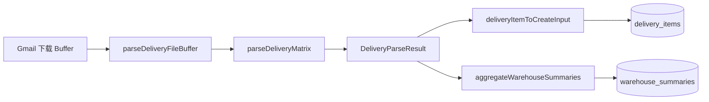

# Excel / CSV 派送表解析 — 完整说明

> 说明 Gmail 附件（及本地上传）中 **派送明细表** 如何被读入、映射字段、写入 `delivery_items` / `warehouse_summaries`。  
> 与 [06-Gmail检索与解析说明.md](./06-Gmail检索与解析说明.md) 配套阅读。

---

## 一、项目里两种 Excel，不要混

| 类型 | 用途 | 核心文件 | 入库表 |
|------|------|----------|--------|
| **派送明细表** | Gmail 附件里的 FBA/仓库/箱数明细 | `delivery-excel-parser.ts` | `delivery_items` + `warehouse_summaries` |
| **订单大表导入** | Google Sheet 模块批量导入柜号订单 | `order-sheet-import.ts` | `google_sheet` |

本文重点讲 **派送明细表**（第一种）。文末简要提第二种。

---

## 二、解析在整体链路中的位置



**谁调用 `parseDeliveryFileBuffer`：**

| 调用方 | 文件 |
|--------|------|
| 订单「检索」（线 A） | `order-parse-service.ts` |
| 按柜号 / 指定附件（线 B） | `container-parse-service.ts`（部分仍用 `parseDeliveryExcelBuffer`，不含 CSV 文件名分支时需走 File 版） |

线 A 统一走 **`parseDeliveryFileBuffer(buffer, filename, containerNo)`**，因此 **`.csv` 与 `.xlsx` 都支持**。

---

## 三、入口函数

### 3.1 `parseDeliveryFileBuffer`（推荐入口）

```typescript
parseDeliveryFileBuffer(buffer, filename?, defaultContainerNo?)
```

| 参数 | 作用 |
|------|------|
| `buffer` | Gmail 下载或上传文件的二进制 |
| `filename` | 用于判断是否 `.csv`（如 `表格_20260603.csv`） |
| `defaultContainerNo` | 表内无柜号列时，用订单/检索的柜号填充 |

分支：

```
filename 以 .csv 结尾 → parseCsvBufferToMatrix → parseDeliveryMatrix
否则                  → ExcelJS 读 xlsx      → parseDeliveryMatrix
```

### 3.2 `parseDeliveryExcelBuffer`

只处理 xlsx，不识别 CSV。线 B 部分旧代码仍直接调此函数。

### 3.3 返回值 `DeliveryParseResult`

```typescript
{
  headerRow: number;      // 表头在第几行（1-based，给人看）
  items: DeliveryItemParsed[];
  summaries: WarehouseSummaryComputed[];
  warnings: string[];     // 全局警告（如「第 5 行：箱数为空」）
}
```

---

## 四、解析流水线（五步）

```
① 读成二维矩阵 string[][]
② detectHeaderRow     在前 30 行找表头
③ buildColumnMap      表头 → 标准字段名
④ 逐行 parseDeliveryMatrix
⑤ aggregateWarehouseSummaries
```

### 4.1 读矩阵

**xlsx**（`excel-utils.ts`）：

- `loadWorkbook(buffer)` → ExcelJS
- 只读 **第一个工作表** `worksheets[0]`
- `getWorksheetRows(worksheet, 30)`：每行最多 30 列，去掉行尾空单元格

**csv**（`delivery-excel-parser.ts`）：

- 优先 UTF-8，乱码则 fallback `latin1`
- 去 BOM（`\uFEFF`）
- 自动判断分隔符：**Tab 多于逗号用 Tab，否则逗号**
- 支持引号包裹字段、`""` 转义

### 4.2 表头识别 `detectHeaderRow`

在前 **30 行**内扫描，某行经 `normalizeHeader` 后与 `HEADER_KEYWORDS` 命中 **≥2 个** 即视为表头：

```typescript
HEADER_KEYWORDS = [
  "fba", "reference", "warehouse", "仓库", "箱数", "carton", "柜号"
]
```

找不到则默认 **第 0 行** 为表头。

**normalizeHeader：** 去空格、转小写，例如 `"FBA ID"` → `"fbaid"`。

### 4.3 列映射 `FIELD_ALIASES`

表头单元格 normalized 后查表，映射到标准字段 key：

| 表头别名（部分） | 标准字段 | 入库列 |
|------------------|----------|--------|
| 柜号 / containerno | `container_no` | `container_no` |
| 客户代码 / 唛头 / SO | `customer_code` | `customer_code` |
| FBA / FBA ID / fbaid | `fba_id` | `fba_id` |
| Reference / PO | `reference_id` | `reference_id` |
| CBM / 体积 | `cbm` | `cbm` |
| Weight / 重量 | `weight` | `weight` |
| 箱数 / cartons | `carton_count` | `carton_count` |
| 仓库 / 仓库代码 | `warehouse_code` | `warehouse_code` |
| 派送方式 | `delivery_method` | `delivery_method` |
| 客人备注 / 客户备注 | `customer_note` | `customer_note` |
| 实际箱数 | `actual_carton_count` | `actual_carton_count` |
| 打板数量 | `pallet_count` | `pallet_count` |
| 仓库备注 | `warehouse_note` | `warehouse_note` |

完整列表见 `src/lib/delivery-excel-parser.ts` 中 `FIELD_ALIASES`。

**未出现在映射表里的列会被忽略。**

### 4.4 数据行规则

从 **表头下一行** 开始到矩阵末尾：

| 规则 | 行为 |
|------|------|
| 整行空 | 跳过 |
| 含「合计 / 总计 / total」 | 跳过（汇总行） |
| 无柜号 | 用 `defaultContainerNo`；仍无则 **跳过该行** |
| FBA、Reference、仓库、箱数 **全空** | 跳过（视为无效行） |
| 仓库为空 | 仍入库，但 `warnings` 加「仓库代码为空」 |
| 箱数为空 | 仍入库，但 `warnings` 加「箱数为空」 |

**数值列**（箱数、CBM、重量等）：走 `cellToNumber`，去掉千分位逗号。

**文本列**：trim 后写入。

**柜号列**：若表里有柜号列，取单元格值并 `toUpperCase()`。

### 4.5 仓库汇总 `aggregateWarehouseSummaries`

按 `warehouse_code`（大写）分组：

- `total_cartons` = 组内 `carton_count` 之和（null 当 0）
- `item_count` = 组内明细行数

结果写入 `warehouse_summaries`（线 A 还带 `batch_no`）。

若解析结果里 `summaries` 为空，线 A 会用明细再算一遍 `aggregateSummaries`。

---

## 五、入库：`deliveryItemToCreateInput`

把 `DeliveryItemParsed` 转成 Prisma `createMany` 结构：

```typescript
deliveryItemToCreateInput(item, {
  attachment_id,   // 线 A 有
  container_id,    // 线 A 有
  batch_no,        // 线 A 有
})
```

对应表 `delivery_items`（`prisma/schema.prisma`）。

---

## 六、工具库 `excel-utils.ts`

| 函数 | 作用 |
|------|------|
| `cellToString` | 单元格 → 字符串（兼容 Date、公式 result、rich text） |
| `cellToNumber` | 去逗号后转 number，失败返回 null |
| `cellToDate` | 转 Date（派送表少用，订单导入用） |
| `normalizeHeader` | 表头规范化 |
| `loadWorkbook` | Buffer → ExcelJS Workbook |
| `getWorksheetRows` | Worksheet → `string[][]` |

---

## 七、解析状态与 warnings 如何影响业务

| 情况 | `parse_status`（线 A attachments/containers） |
|------|-----------------------------------------------|
| 0 条有效明细 | `failed`，不入库 |
| 有明细 + warnings | `partial_success` 或 attachment 级 warning |
| 全部正常 | `success` |

`warnings` 会：

- 写入 `parse_logs`（step=`parse_excel`）
- 出现在 API 响应 / toast
- 写入 `attachments.error_message`（拼接前几条）

---

## 八、示例：表长什么样能解析

**表头行（示例）：**

| 柜号 | 客户代码 | FBA ID | Reference | 箱数 | 仓库代码 | CBM | 重量 |
|------|----------|--------|-----------|------|----------|-----|------|

**或英文：**

| Container No | Customer | FBA | PO | Cartons | Warehouse | CBM | Weight |

**表头前可以有标题行**（公司名、日期等），只要前 30 行内有一行命中 ≥2 个关键词即可。

**CSV 示例：** `表格_20260603.csv`，UTF-8 或 GBK（latin1 fallback），逗号或 Tab 分隔。

---

## 九、与 Gmail 预览解析的差异

`gmail.ts` 里 `downloadAndParseExcel` 也用 ExcelJS，但是：

- 固定 **第一行** 为表头（不做 `detectHeaderRow`）
- 输出 `{ headers, rows }` 给 **弹框预览**，不一定走 `delivery-excel-parser`

**真正入库** 以 `delivery-excel-parser.ts` 为准。

---

## 十、另一种 Excel：Google Sheet 订单导入

文件：`order-sheet-import.ts`  
入口：`parseOrderSheetBuffer` → 导入 `google_sheet` 表（柜型、ETA、码头等 **23+ 字段**）。

- 另一套 `HEADER_ALIASES`（不是 FBA 明细）
- 同样用 `excel-utils` 读 xlsx
- **与 Gmail 派送明细解析无关**

API：`POST /api/v1/google-sheet/import`

---

## 十一、扩展与调试

### 11.1 新增列映射

1. 在 `FIELD_ALIASES` 增加别名 → 标准 key  
2. 确认 `DeliveryItemParsed` 类型已有字段  
3. 确认 `delivery_items` 表有列  
4. 在 `deliveryItemToCreateInput` 里带上该字段  

若新列名无法被 `normalizeHeader` 匹配，可同时加 **原始中文 key**：

```typescript
FIELD_ALIASES["新表头名称"] = "warehouse_code";
```

### 11.2 表头识别不到

- 看 Excel 前 30 行是否含至少 2 个 `HEADER_KEYWORDS`  
- 可在 `HEADER_KEYWORDS` 增加业务常见词  
- 或改 `detectHeaderRow` 的 `hits >= 2` 阈值（慎用）

### 11.3 解析 0 条

检查顺序：

1. 附件是否真是 xlsx/csv  
2. 表头是否被识别（看 `parse_logs` 里 headerRow）  
3. 数据行是否被「全空字段」规则跳过  
4. 柜号是否缺失且无 `defaultContainerNo`  

### 11.4 本地单测思路

```typescript
import fs from "fs";
import { parseDeliveryFileBuffer } from "@/lib/delivery-excel-parser";

const buffer = fs.readFileSync("./test.xlsx");
const result = await parseDeliveryFileBuffer(buffer, "test.xlsx", "EGSU6027772");
console.log(result.headerRow, result.items.length, result.warnings);
```

（需在 tsx / 临时脚本中跑，项目内暂无正式 test 文件。）

---

## 十二、源码精读顺序

| 顺序 | 文件 |
|------|------|
| 1 | `src/lib/excel-utils.ts` |
| 2 | `src/lib/delivery-excel-parser.ts` ⭐ |
| 3 | `src/lib/order-parse-service.ts` → `parseAndPersistAttachment` |
| 4 | `src/lib/container-parse-service.ts` → `parseContainerAttachment` |
| 5 | `prisma/schema.prisma` → `delivery_items` / `warehouse_summaries` |

---

## 十三、常见问题

| 现象 | 原因 | 处理 |
|------|------|------|
| CSV 乱码 | 非 UTF-8 | 已尝试 latin1；建议发件人 UTF-8 导出 |
| 列对不上 | 表头不在 `FIELD_ALIASES` | 加别名 |
| 少很多行 | 被「无效行」规则过滤 | 看是否缺 FBA/仓库/箱数 |
| 合计行入库 | 合计行含其他数据且未命中关键词 | 改 `isSummaryRow` |
| xlsx 只读 Sheet1 | 设计如此 | 明细应在第一个 sheet |
| 与弹框预览不一致 | 预览走 gmail 简单解析 | 以 delivery-excel-parser 为准 |

---

*相关文档：[06-Gmail检索与解析说明.md](./06-Gmail检索与解析说明.md) · [项目导读.md](./项目导读.md)*
